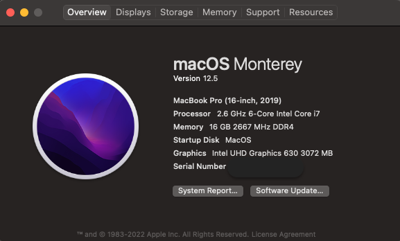

# Hackintosh-Dell-g3-15-3590 

## Laptop Specifications

Model     | Dell g3 15 3590 9th gen
---       | ---
Processor | Intel®️ Core™️ i7 -9750H (12MB Cache, up to 4.5 GHz, 6 cores 9h generation 
iGPU      | Intel UHD 630
dGPU      | NVIDIA(R) GeForce(R) GTX 1660 Ti with Max-Q Design, 6GB GDDR 6
Resolution| 15.6 inch FHD (1920 x 1080) 30 0 nits IPS Anti-Glare LED Back lit Display with 144Hz refresh rate
RAM       | 16GB, 2x8GB, DDR4 (2666MHz) 
Storage   | 256GB M.2 PCIe NVMe Solid State Drive (Boot) + 1TB 5400 rpm 2.5" SATA Hard Drive (Storage)
Audio     | Realtek ALC295
WIFI      | Intel AC9560 
Touchpad  | I2C1 HID TPD0
Bios      | 1.13.0 `latest`

## System configuration

Model | `MacBookPro16,4` | OS | `Big Sur 11.0.1` | OC | `0.7.1`
---|---|---|---|---|---

## what is working

✅ QE/CI Graphics Intel UHD 630  
✅ Restart, Sleep and Shutdown (With and without Closing LID)  
✅ CPU Power Management  

Idle                                                  |   Boost 
---                                                   |    --- 
  |   

---

✅ Internal speaker , headphone (with microphone) 
HeadPhone                                              |    Mic 
---                                                    |    --- 
  |   

---

✅ Touchpad (SSDT Patche Interrupt GPIO Pinning) 'note that acpibattery.kext causes touchpad lag , using smcbatterymanager.kext fixed the issue'  

---

✅ Brightness (including f11 and f12)  
✅ Battery Indicator  
✅ Ethernet  
✅ Wifi  
✅ Bluetooth  

✅ All USB Port (including usb type c)  
✅ External Monitor work with type c cable
✅ prtScr key disables touchpad & winKey + prtScr disables keyboard

## what is not working

❌ internal microphone (Smart Sound Technology is not supported by mac) 
❌ awaking from sleep needs some keyboard presses (acpi_wake_type did not fix it)

